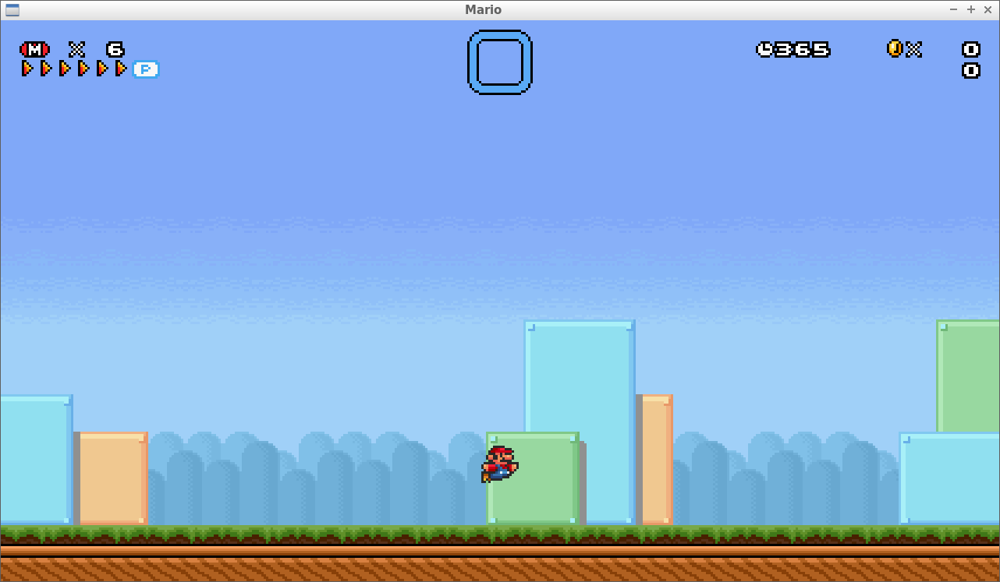

Mario
=====

A C++ clone of the classic Super Mario Bros. games.

Compiling
---------
You will need a compiler supporting C++11.
So far, only mingw-w64-g++ 4.8 on Windows has been used, although the code is very portable.
You will also need the following libraries:
- SDL2
- SDL2_mixer
- opengl
- DevIL
- boost
- rapidxml

Resources
---------
These are needed to run the game in it's current form.
I've shared them publicly in my Dropbox: http://bit.ly/1myJJk0
Copy everything from there to the /resources directory.

Documentation
-------------
This varies depending on the source file.
Some are well documented, others could use some serious work.
If you follow the path of execution from Main.cpp it should be self-explanitory for the most part.

License
-------
I haven't formally decided on a license for this project yet.
